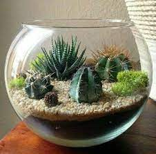

# pw-terrarium-2023a

## Descripcion 
Proyecto de la clase de programacion web orienta a practicar las bases del codigo HTML + CCS + JS 

## Autor

Soy un pequeño desarrollor y estudiante del Tecnologico de la Gustavo A. Madero

## Notas de clase

1.HTML
2.CSS
3.javascript